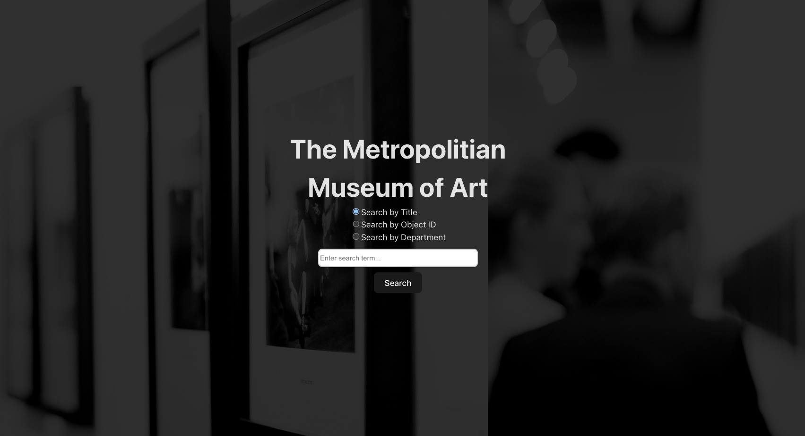

# The Metropolitan Museum of Art Search App

This application is gives the user the ability to search for art from the The Metropolitan Museum of Art's collection. The search fields can be title, objectID and can be filtered by department as well. The app fetches data using the plubic API provided so kindly by The Metropolitan Museum of Art. The display is meant to be responsive and easy to navigate. 


## Features

- Search by Title: Enter a title to find art pieces that match.
- Search by Object ID: Directly search for a specific art piece using its unique object ID.
- Search by Department: Enter a title to filter by department. 
- Responsive Design: The app is designed to be responsive and user-friendly across different devices.

## Screenshot
.

## Installation

I. Clone the Repo 

```bash
 git clone https://github.com/yourusername/met-museum-search-app.git
 cd met-museum-search-app
```

II. Install the dependecies

```bash
 npm Install 
```


III. Run the application 

```bash
  npm run dev
```
    

## Usage

### I. Select a search choice: 

Title, Object Id, or by department

### II. Enter text

Example Title: "The Mona Lisa"

Example DepartmentId: "123"

Example Department Filter: no input needed or enter a title


## Tech Stack

React: For UI (user interface).

Axios: For API requests.

Vite: For fast and efficient development.

## API Reference

This app uses The Metropolitan Museum of Art Collection API. More information about the API can be found here - [MET API](https://metmuseum.github.io)


## Contributing

Contributions are welcome! Please fork the repository and submit a pull request for any improvements or bug fixes.


## License

This project is licensed under the MIT License. See the LICENSE file for details.


## Acknowledgements


The Metropolitan Museum of Art for providing a public API to access their collection.

The React community for their extensive documentation and support.

Pixaby for image

## Feedback

Feel free to email me if you have any questions raider4414@gmail.com

